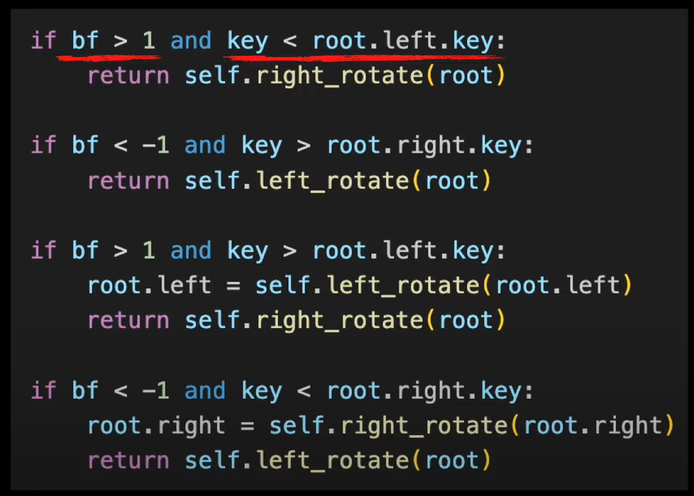
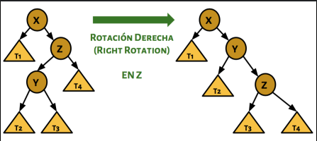

# Unidad: Árboles 🌲

## 1. Árboles Binarios

- Estructura recursiva: cada nodo tiene **0, 1 o 2 hijos**.
- Tipos:
  - **Completo**: todos los niveles llenos excepto quizás el último, que se llena de izquierda a derecha.
  - **Lleno**: todos los niveles tienen todos los nodos posibles.
- **Altura**: cantidad de aristas del camino más largo desde la raíz hasta una hoja.
  - Árbol vacío: altura = -1
  - Nodo único (raíz): altura = 0

---

## 2. Árboles de Expresión (Expression Trees)

- Usados para representar expresiones algebraicas.
- **Nodos internos**: operadores (`+, -, *, /, ^`)
- **Hojas**: operandos (números o variables)
- Aceptan solo **expresiones con paréntesis**, por claridad y precedencia.
- Ejemplo: `( (2 + 3.5) * -10 )`

### Recorridos:

| Tipo       | Notación    | Orden         |
|------------|-------------|---------------|
| In-order   | Infija      | L V R         |
| Pre-order  | Prefija     | V L R         |
| Post-order | Postfija    | L R V         |

### Evaluación:

- Método `eval()` devuelve el resultado de la expresión.
- También se pueden evaluar expresiones con **variables**.
- Permiten exportarse a texto (e.g., para guardarlos en archivos o reconstruirlos).

---

## 3. Árbol Binario de Búsqueda (BST)

- Cada nodo cumple: 
  - Subárbol izquierdo < nodo ≤ Subárbol derecho
- Operaciones principales:
  - `insert(x)` → O(log n) promedio, O(n) peor caso
  - `find(x)` → búsqueda binaria
  - `remove(x)`:
    - R1: hoja → eliminar directo
    - R2: un hijo → reemplazar por el hijo
    - R3: dos hijos → reemplazar por **inorder predecessor** o **inorder successor**

### Recorridos posibles:

- In-order → ordenado
- Pre-order / Post-order
- Por niveles (nivel a nivel, útil para visualización)

### Iteradores:

- Se puede hacer iterable el árbol (inOrder, byLevels, etc.)
- `setTraversal(Traversal.INORDER)` permite cambiar la estrategia

---

## 4. Árboles Balanceados (AVL)

- Extensión de BST con **balanceo automático**.
- Propiedad: para cada nodo, la diferencia de altura entre subárbol izquierdo y derecho es **-1, 0 o +1**. (left - right)
- Rebalanceo mediante **rotaciones**:
  - **Rotación simple** (izquierda o derecha)
  - **Rotación doble** (izquierda-derecha o derecha-izquierda)

### 🔄 Tabla de Rotaciones AVL según el Balance Factor

📌 **Notas**:
- El nodo **z** es el primero que se detecta con `|BF| > 1`.
- El hijo problemático **y** es el que generó el desbalanceo.
- Si BF del hijo es 0, se trata como el caso de rotación **simple**.
- En inserciones, el hijo nunca tendrá BF = 0 al momento de rotar (solo pasa en borrado).

### Ventajas:

- Mantiene altura logarítmica → operaciones O(log n)
- Mejora la performance de búsqueda en comparación con BST degenerado

---

## 5. Comparación rápida

| Tipo de Árbol | Ordenado | Balanceado | Operaciones eficientes |
|---------------|----------|------------|------------------------|
| Expresión     | ❌        | N/A        | Evaluación algebraica  |
| BST           | ✅        | ❌         | Insertar, buscar       |
| AVL           | ✅        | ✅         | Insertar, buscar, borrar O(log n) |

